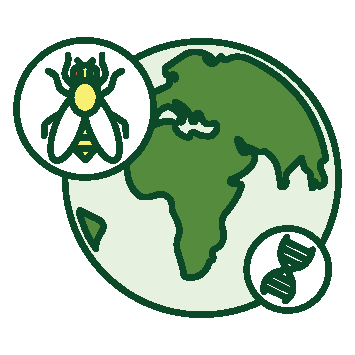
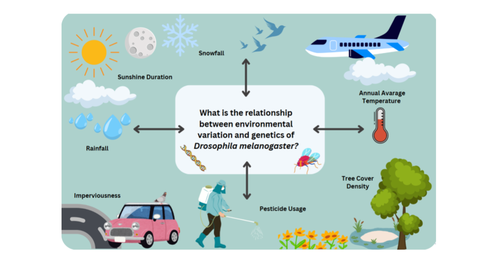

<!-- PROJECT LOGO -->
 

  

<h3 align="center">Use Case 3 - <em>Drosophila</em> Genetics </h3>

  

    The objective of Use Case 3 is to integrate genomic data of the fruit fly <em>Drosophila melanogaster</em>, which is one of the best-studied model organisms and a world-wide human commensal, with comprehensive environmental and climate information. This interdisciplinary approach aims to identify how environmental factors shape genetic variation and influence evolutionary processes. 
    The repository is organized into subdirectories, each of which is linked to a specific project or component contributing to Use Case 3.
  

   

     
    <a href="https://fairicube.nilu.no/"><strong>Explore FAIRiCUBE »</strong></a>
     
     
    <a href="https://fairicube.nilu.no/uc3-environmental-adaptation-genomics-in-drosophila/">Website</a>
    &middot;
    <a href="https://fairicube.readthedocs.io/en/latest/user_guide/eox_lab/">FAIRiCUBE Lab</a>
    &middot;
    <a href="https://catalog.eoxhub.fairicube.eu/">Metadata Catalog</a>
  

## About the Repository

The structure of this GitHub repository, with its multiple subdirectories, emerged directly from the interdisciplinary nature of the project. The integration of genomic data with Earth Observation (EO) data presented unique challenges that required the development of tailored tools and workflows. One such example is the "QueryCube" tool, which was specifically created to bridge the gap between these distinct data domains and enable meaningful cross-domain analysis. Rather than being predefined, the subdirectories evolved organically as different scientific disciplines—ranging from bioinformatics to geospatial science—contributed their perspectives, methods, and requirements. The resulting modular organization is very crosslinked and reflects this collaborative process and ensures that the project remains extensible, transparent, and usable across diverse research communities.

## Hypothesis And Research Questions

Research Questions On Urban <em>Drosophila</em>  

1. What is the species composition of <em>Drosophila</em> communities in urban environments? 
2. What are the key environmental factors that determine the distribution of flies in the City of Vienna? 
3. How does the genetic diversity of urban <em>D. melanogaster</em> populations compare with that of populations from rural regions? 
4. Can citizen science provide reliable data on the diversity and ecology of Drosophila in urban environments? 
5. How does participation in such a project influence public awareness and interest in biodiversity and scientific research? 

Research Questions On European <em>Drosophila</em>

7. How does environmental variation across space and time correlate with patterns of genetic diversity in <em>D. melanogaster</em> populations? 
8. Which genomic regions or genes in <em>D. melanogaster</em> show signatures of adaptation to specific environmental conditions? 
9. Can combinations of environmental factors predict changes in genetic structure or the presence of adaptive alleles in natural populations? 

## Projects

### [Vienna City Fly](https://nhmvienna.github.io/ViennaCityFly/)
This repository [Urban Drosophila Ecology](https://github.com/capoony/UrbanDrosophilaEcology) engages with the uran ecology aspect of the City Fly Project. It contains the complete data analysis pipeline for the Vienna City Fly Project, including combination of species abundance data with high-resolution environmental and climate data to understand how urban landscapes influence Drosophila community structure and distribution.
The directoryIt includes tools for data collection from non-professional contributors, platforms for public interaction, and methodologies for quality control and validation of user-submitted data.

### [Gap Filling](projects/gap_filling)
This sub-project handles missing data issues within environmental or observational datasets. It explores algorithms and methodologies for interpolating, estimating, or simulating missing values based on surrounding information or predictive models.

### [QueryCube](projects/QueryCube)
The FAIRiCUBE "Query Cube" aims to fill this gap, enabling users with little experience in working with geospatial data to access relevant values from gridded resources for the point locations they’re interested in. All the user must do is to provide a coordinate pair, and indicate for which of the available gridded resources they’d require values. The Worm Picker accesses the complete FAIRiCUBE at the spatial location specified, and extracts a vector containing the requested information.

### [Environmental Association Analysis](projects/LandscapeGenomicsPipeline)
Dedicated to the analysis pipeline, this directory includes scripts and tools for downlaoding and processing raw data, statistical analysis, visualizations, and reporting. It supports both exploratory and confirmatory data analysis for Use Case 3.

### Use Case Summary

Overall, The research of Use Case 3 has improved our understanding of the relationship between environmental factors and biodiversity focusing on fruit flies of the genus <em>Drosophila</em>. By integrating various earth observation and biodiversity datasets and employing innovative analytical techniques, the project shed light on the ecology and evolutionary potential of urban <em>Drosophila</em> species facing global environmental changes. Empowered by Citizen Science we investigated environment influence the urban <em>Drosophila</em> species community and the genetic variation of Drosophila melanogaster populations. In summary, our “Drosophila adaptation” use case, successfully combined comprehensive earth observation data for climate and land use available in the public domain with newly generated biodiversity and genetic datasets to gain novel insights into how biodiversity is influenced by environmental change. 

For a more visual representation of our UC concept, have a look [here](https://uc3.fairicube.nilu.no/).

(<a href="#readme-top">back to top</a>)

