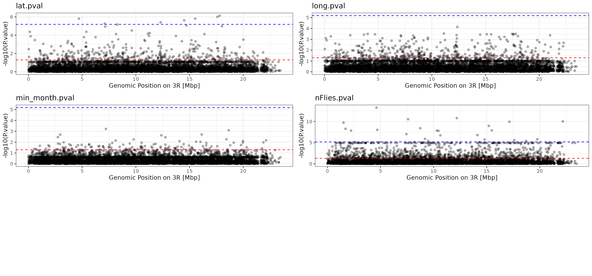
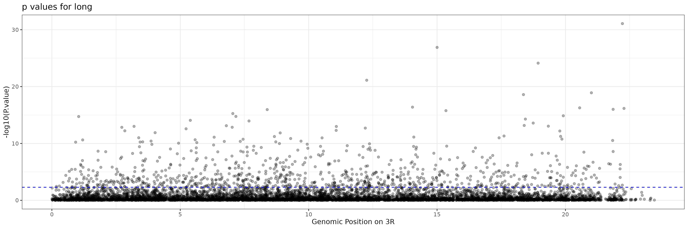
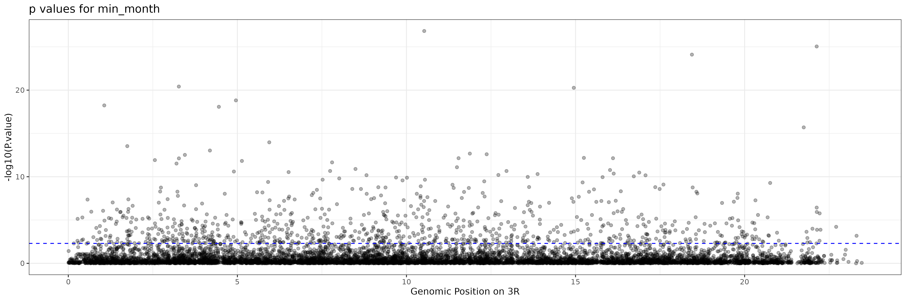
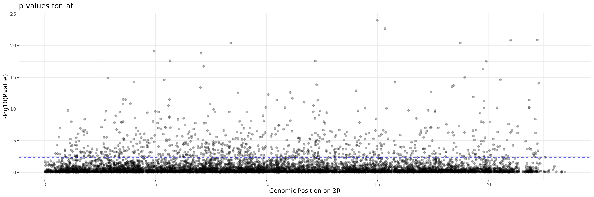
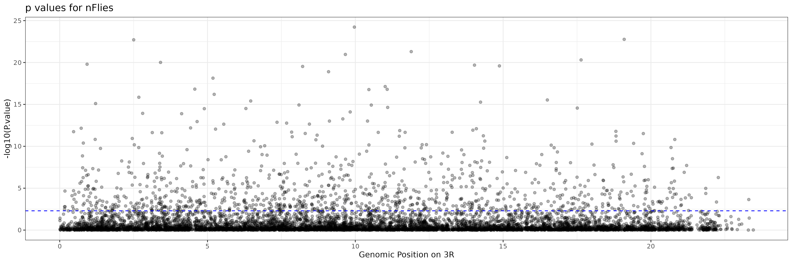
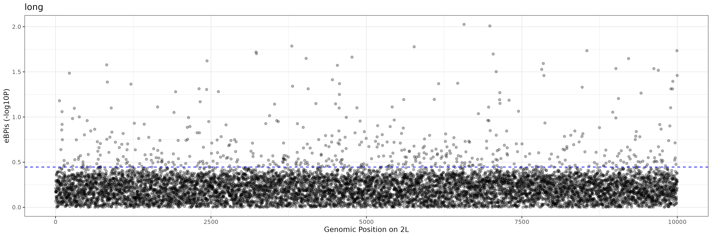
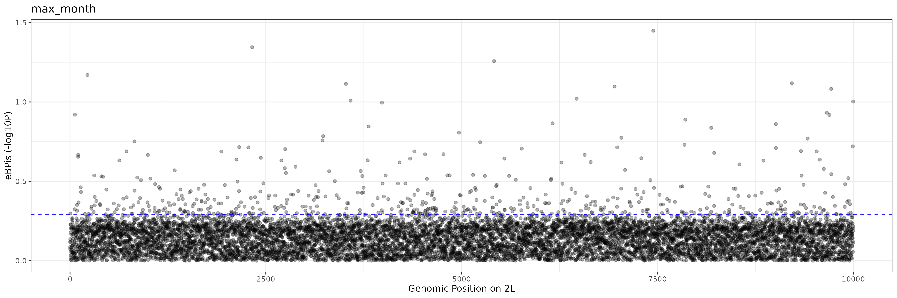
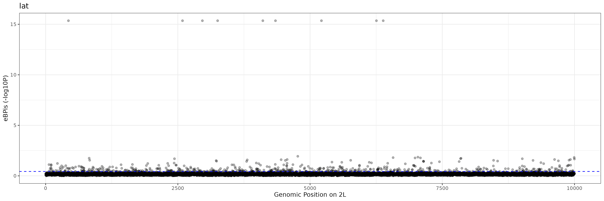
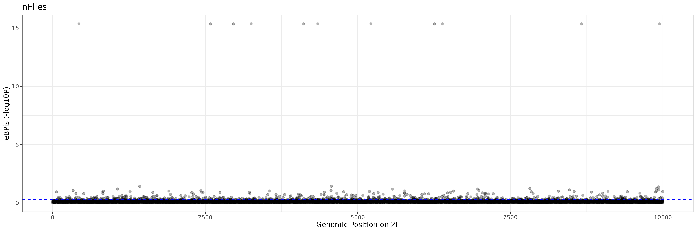
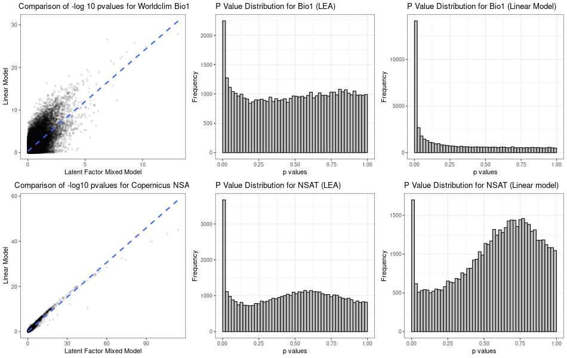

# Landscape Genomics Pipeline 

This repository is supposed to hold documentation on the DEST_Pipeline derivative used for the UC3 Project of FAIRiCUBE.
This is a standalone repository, as well as a directory within the FAIRiCUBE uc3-drosophila-genetics.
All the scripts used in the workflow are provided via the scripts directory.

## Objectives

This pipeline is designed to perform genetic data analysis on a dataset that includes samples from various populations. While the script covers the analysis for all samples, the results presented here focus specifically on the Austrian population samples within one genomic region.

## Requirements
- VCFTools
  - http://vcftools.github.io/license.html

- Baypass2.3 
  - https://forgemia.inra.fr/mathieu.gautier/baypass_public 

- LEA R-Package (Citation)
  - https://www.bioconductor.org/packages/release/bioc/html/LEA.html

    
- Working with Modules
  -    https://modules.readthedocs.io/en/stable/INSTALL.html


## Workflow Contents 

<!--ts-->

* [Set Up Environment](#set-up-environment)
* [Download Data](#download-genomic-data)
  * [Get Environmental Data](#download-environmental-data) 
* [Define Metadata / Covariates for analyses](#define-metadata-and-chromsomal-regions) 
* [Subsample VCF for chromosomal arms](#subsample-vcf-for-chromosome)
  * [Remove Polyploides](#subsample-vcf-for-chromosome)
  * [Subsample 10k Variants](#subsample-vcf-for-chromosome)
  * [Convert to Allele Frequencies](#subsample-vcf-for-chromosome)
* [Linear Model](#linear-model-with-r)
* [Latent Factor Mixed Model](#latent-factor-mixed-model)
* [Baypass Analysis](#baypass-analysis)
* [Result Interpretation and Comparison](#result-interpretation-and-comparison)
<!--te-->

x) The detailed workflow can be viewed and executed according to [main.sh](main.sh)

---

## Preliminary Results on Test Data


## Workflow Step by Step

### Set Up Environment

This section does not yet contain specific guidance on installation of required programs. The purpose of this chapter is to define a working directory for the pipeline to run without any issues and to produce a structured output.
More information on how to install required software can be found in the [Requirements section](#requirements).

```bash
# Declare your work environment and provide a file with the names of the populations you want to analyze.
cd $wd
mkdir data
mkdir results
#Load required Packages and Programs.
module load Tools/vcftools_0.1.13
```

### Download Genomic Data

The data on geolocation of Drosohila melanogaster samples togehter with the according metadata, as well as the genetic data as VCF can be retrieved via DEST.bio.
Please be aware that these specific VCFs are large files and therefore download might take longer as usual. 


```bash
#Download DEST Drosophila data via wget as well as metadata created by DEST working group.
cd data
wget --tries=inf "http://berglandlab.uvadcos.io/gds/dest.all.PoolSNP.001.50.25Feb2023.norep.ann.gdsdest.all.PoolSNP.001.50.25Feb2023.norep.vcf.gz"
wget "https://github.com/DEST-bio/DESTv2/blob/main/populationInfo/dest_v2.samps_25Feb2023.csv"
mv data/dest.all.PoolSNP.001.50.25Feb2023.norep.vcf.gz data/PoolSeq2023.vcf.gz

#Here we are assuming we are analyzing all samples provided in the file. If analysis of selected fly populations is desired, please alter the awk command accordingly.
awk '{FS=","}{if (NR!=1) {print $1}}' dest_v2.samps_25Feb2023.csv > samplenames.csv
samples="data/samplenames.csv"

#Differently, there is a samplefile that stores all the information on the samples that is not genomic. This is the basis for our metadata file, that will be generated from this.
samplefile="data/samps_25Feb2023.csv"

#The VCF file will be the main input file for the analysis. 
input="data/PoolSeq2023.vcf.gz"
cd $wd
```

### Download Environmental Data

If you want to work with customly aquired environmental data, make sure you put it in the corresponding format, the number of variables (columns) is not limited. The file structure can be taken from [metadata.csv](results/metadata.csv) which will be created in the next step of the workflow. 

| Sample ID       | Variable 1      | Variable 2      |
| --------------- | --------------- | --------------- |
| AT_Kar_See_1_2014-08-17 | 44 | 255 |
| CH_Vau_Vul_1_2020-09-15| -128| 240 |
|CM_Nor_Oku_1_2004-04-15|  63|  54|
|  |  |  |

#### Suggested Tool FAIRiCUBE WORMPICKER 

[FAIRiCUBE Wormpicker GitHub R](https://github.com/FAIRiCUBE/uc3-drosophola-genetics/tree/NHM/projects/WormPicker)


#### Define Metadata And Chromsomal Regions

```bash
#Create metadata.csv from the original DEST sample.csv
{
  head -1 $samplefile
  grep -f $samples $samplefile
} |
  cut -d "," -f1,4,5,12,6,7,24,30,41 \
    >results/metadata.csv

#Use predefined metadata or enter path to your custom metadata file
metadata="results/metadata.csv"
```

Be aware, that ALL the following steps are all performed in a for-loop that is based on chromosomal regions. The Loop continues after this section [see main.sh](main.sh).

```bash
#Get all chromosomal regions in your data and set as input what you want to analyze. In the case of the provided VCF file by DEST.bio, regions are provided as chromosomal arms and analysis will be performed according to these arms.

genomic_regions=($(gunzip -c data/PoolSeq2023.vcf.gz | awk '/^[^#]/ {print $1}' | sort -u))

```

```bash
for value in "${genomic_regions[@]}"; do
    arm=$value
    mkdir results/${arm}
  
    # Declare the VCF File as Input File for the    following steps:
    output="results/${arm}/Subsampled_"${arm}".recode.vcf.gz" 
    outaf="results/${arm}/Subsampled_"${arm}".recode.af"
    #...

```


### Subsample VCF for chromosome

```bash
    ### This step removes polyploidies, focus on 3R (Chromosome) and subsample 9 population samples and exlcude all sites with missing data
    zcat ${input} |
      awk '$0~/^\#/ || length($5)==1' |
      awk '$0~/^\#/ || $1=="'$arm'" ' |
      vcftools \
        --vcf - \
        --keep ${samples} \
        --stdout \
        --recode |
      grep -v "\./\." |
      gzip > ${output}

    ### randomly pick 10k lines
    python scripts/SubsampleVCF.py \
      --input ${output} \
      --snps 10000 |
      gzip >${output}.k10.gz

    ### convert to AFs
    python scripts/VCF2AF.py \
      --input ${output}.k10.gz \
      >${outaf}.k10

```

### Linear Model With R 

This is a simple regression statistics performed in R.

```bash

    Rscript scripts/Plot_pvalues.R $wd ${outaf}.k10 $metadata $arm
  
```


### Baypass Analysis

**`Attention when creating geno file:`**  Keep in mind, for this pipeline only a few samples are used therefore there are more likely "monomorphic" sites, if there are no monomorphic sites all will be kept and all positions are represented in the keep-file.
In this analysis, a *.geno* and a *.poolsize* file are needed and created. Also, a file that analyses possible covariates based on values being numeric is created and this infomration is used to parse possible covariates to the LFMM statistics.

```bash
    bayin="${output}.k10.gz"
    baydir="results/${arm}/BAYPASS/"
    mkdir $baydir
    bayout=${baydir}"baypass.geno"
    baycov=${baydir}"covariates.csv"

#python3 /media/inter/ssteindl/DEST/LanGen/BAYPASS/geno_creation_ext.py --input $input --output ${baydir}${bayout}
     python3 scripts/geno_creation_ext.py \
        --input $bayin\
        --output $bayout \
        --samples $samples \
        --metadata $metadata

    python3 scripts/create_cov.py --input $samplefile --output $baycov --samples $samples
    genofile=${bayout}
    variables=$(<"results/2L/BAYPASS/covariates.covariate.info.csv")

##Result
#reate on results folder with subdirectories (results for each method) and one general "comparison result"??
    /media/inter/ssteindl/DEST/LanGen/baypass_2.3/sources/g_baypass -npop $(wc -l $samples) -gfile $genofile -efile $baycov -outprefix $baydir/BayPass -poolsizefile ${baydir}/size.poolsize

    Rscript scripts/baypass_plotXtX.R ${baydir}/BayPass_summary_pi_xtx.out ${arm}

    Rscript scripts/baypass_plot_eBPis.R ${baydir}/BayPass_summary_betai_reg.out ${arm} results/2L/BAYPASS/covariates.covariate.info.csv
  
```


### Latent Factor Mixed Model 

For this part of the analysis, two R scripts are performing the lfmm analysis and intermediate files (genotypes.lfmm & gradients.lfmm) are created.
Each iteration for analysing a variable creates a new folder.

```bash
# Latent Factor Mixed Model

LeaOut="results/${arm}/LEA"
mkdir $LeaOut
# Number of estimated latent factors (nK) and number of i is calculated within LEA_RunLFMM.R with the quick.elbow() function of bigpca-package.
# To run quick.elbow(), manually install: https://cran.r-project.org/src/contrib/Archive/bigpca/bigpca_1.1.tar.gz

# Number of calculation repetitions for each factor.
nR=3
nK=7

for cov in $variables
do

  var=$cov
  for rep in $(seq 1 $nR)
  do
    echo $wd
    echo $metadata
    echo $rep
    Rscript scripts/LEA_RunLFMM.R $LeaOut/${var}_run$rep ${wd}/${outaf}.k10 ${wd}/${metadata} $var 1 
  done
Rscript scripts/LEA_ZPcalc.R $LeaOut $nK $nR ${wd}/${outaf}.k10 $var
done

#done
```


### Result Interpretation And Comparison

The results generated by this pipeline are clear and concise, focusing specifically on the Austrian population samples within one genomic region (Chromosomal Arm 2L). These results include:

P-values and statistical significance measures for genetic factors within the specified genomic region, which are presented in this repository with the help of  **Manhattan-Plots**, which are illustrating the association with the tested variable within the chosen populations via the -log10 p-values for each position (SNP).


#### Results for GM on 2L

Manhattan Plot



#### Results for LEA on 2L










#### Results for BAYPASS on 2L

**eBPIS** 
BAYPASS produces the *summary_betai_reg.out* file [see structure here](results/2L/BAYPASS/BayPass_summary_betai_reg.out) which documents the "Empirical Bayesian P–value(eBPis) in the log10scale for all covariates that went into the [Baypass Analysis](#baypass-analysis).
This eBPis is used to produce the Manhattan-Plots or the covariates.






Some covariates seem to create very high -log10 p-values for multiple SNPs, which are identical, for example nFlies and Latitude. 






**XtX**
Another file that is created is the *summary_pi_xtx.out* file [XtX file](results/2L/BAYPASS/BayPass_summary_pi_xtx.out). This stores the values of the calulated XtX statistics (Günther and Coop (2013)) to identify outlier loci.


## Results FULLGENOME  for 50k SNPS 

### Results for  Linear Model



### Results for LEA