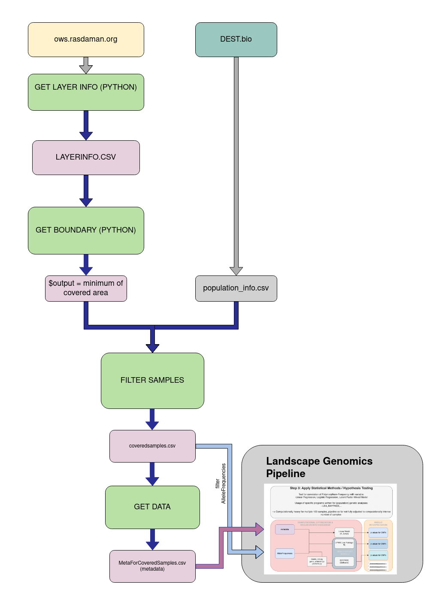

## Wormpicker
While many applications are leveraging the gridded datasets becoming available from diverse sources such as Copernicus services, the European Environment Agency or Eurostat, in most cases, these focus on the spatiotemporal extent, with analyses being performed across multiple grid cells. In addition, the wealth of data provided by these sources can also be valuable for applications focusing on point-based locations. However, at present, it is difficult and resource intensive to extract values for the relevant point-based locations from the gridded resources.

The FAIRiCUBE Worm Picker aims to fill this gap, enabling users with little experience in working with geospatial data to access relevant values from gridded resources for the point locations they’re interested in. All the user must do is to provide a coordinate pair, and indicate for which of the available gridded resources they’d require values. The Worm Picker accesses the complete FAIRiCUBE at the spatial location specified, and extracts a vector containing the requested information.

The Worm Picker is being developed utilizing the OGC Web Coverage Service (WCS), enabling dynamic access to the data being stored on the FAIRiCUBE rasdaman instance. This software will be made available in different forms:
- Web GUI: enables the user to interactively specify both the spatial location and the relevant gridded resources for which to return data;
- Python Library: enables integration of the Worm Picker functionality within python scripts;
- R Library: enables integration of the Worm Picker functionality within R scripts.

This code has been developed within UC3 of FAIRiCUBE the Project. 

Currently the OGC WCS Service used is provided by rasdaman (https://ows.rasdaman.org/rasdaman/ows#/services).
The FAIRiCUBE specific WCS is accessable via: https://fairicube.rasdaman.com/rasdaman/ows#/services 

The main workflow established is executed by several python scripts manually, documented compact in a [main file](main.sh) with execution code, further explanation and backround can be read under [Workflow](#workflow). 

## Requirements

## Repository Structure

- **Data:** Holding input data for filtering. Filtering is implemented, so only layers are used that match with sample coordinates.  
- **Scripts:** All python scripts that will in the end form the function are stored in [scripts](/scripts).
- **Output:** Is storing all intermediate files. 
- **Results:** Will store results of this workflow. 

## Workflow

Visual representation of the worflow can be found [here](#Workflow-Diagram).

### Data

**Sample-Metafile** The file [samps.csv](data/dest_v2.samps_25Feb2023.csv) is holding the information where the samples were taken in lat/long coordinate form and stores additional metadata. The tablecan be downloaded from DESTbio (https://dest.bio/).

### Scripts

**GetWCSlayerInfo.py** This [script](scripts/GetWCSlayerInfo.py) is currently manually accessing ows.rasdaman.org and creates a short description file for GetCapabilities, more specific a csv table with information on all layers provided (name, geo extent and time dimensions) which can be found [here](data/layer_info_WCS.csv).

**GetBoundary.py** This [script](scripts/GetBoundary.py) is designed to find the "minimal overlapping area" of all the layers of interest (provided by a list with paramter -l). The idea is to allow inclusion of all metavariables to all later sample analysis to the same extent.

It is called via shell command and stores minimum and maximum for latitude and longitude in a variable called *output*. This will be used in the next python code. 

**FilterSamples.py** Uses the *output* as reference to filter out samples from [samps.csv](data/dest_v2.samps_25Feb2023.csv), so only sampels that are covered by these layers of interest will be processed. The scripts can be found [here](scripts/FilterSamples.py). 

*Ideally this can be expanded with a method that defines the combination of layers where the most samples are covered to increase meaningfulness of the analysis.*

**GetData.py** This is the code that actually establishes a connection to the rasdaman service and for now "downloads" the data so it can be processed locally. 
In Progress.
Note: This is python code the subprocesses a *curl* command to obtain the data, no Query Language is used so far. 

Filtering: To convert coordinates between EPSG/0/4326 (WGS84) and EPSG/0/3035 (ETRS89 ETRS-LAEA): the pyproj library in Python. This library provides functionalities for coordinate transformations.

### Output

in progress

### Results

Soon :-)

## Workflow-Diagram
 
